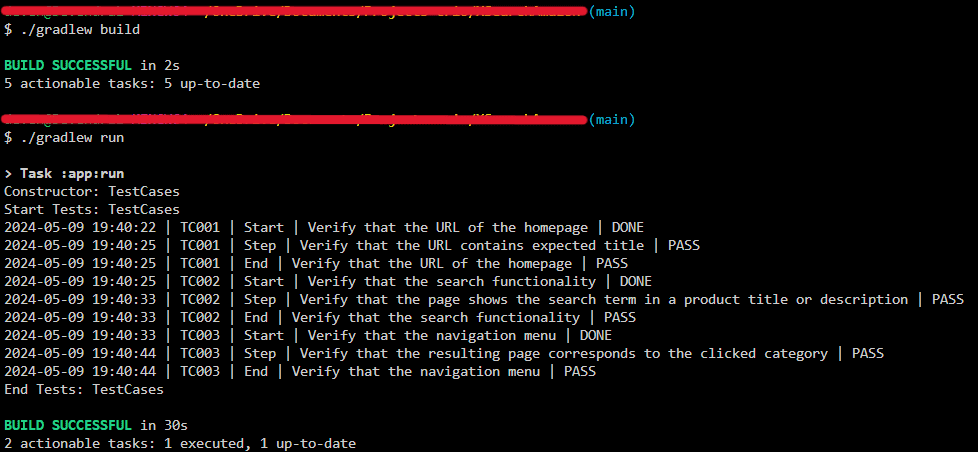

# Amazon Store Automation

`Selenium` `Xpath`

---

This project involves automating the search feature of [Amazon](https://www.amazon.in/) store and validating the resultant data. Additionally menu features and footers are also being validated.

---

# Overview
This project involves automating the search feature of [Amazon](https://www.amazon.in/) store and validating the resultant data. Additionally menu features and footers are also being validated.

# Automating Amazon
## Scope of work
* Automated the following test cases:
    * Verify the URL of the homepage
    * Verify the search functionality
    * Verify the navigation menu

## Skills used
`Selenium` `Xpath`

---

# Screenshots

